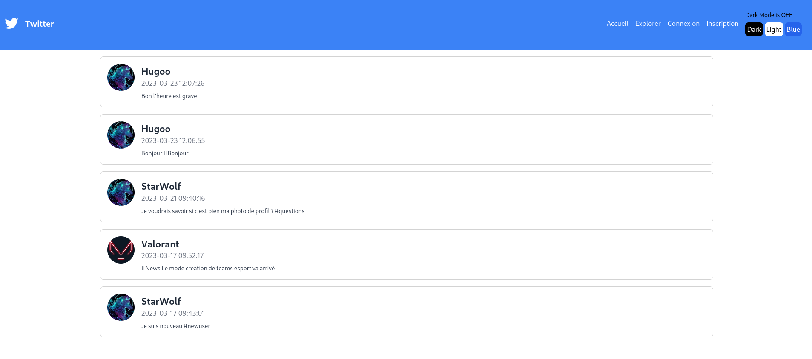
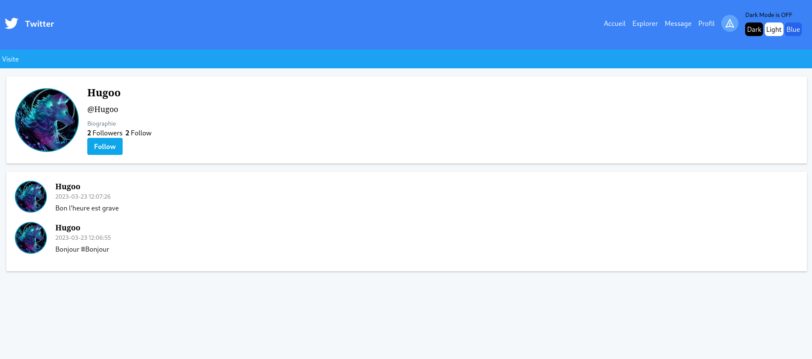
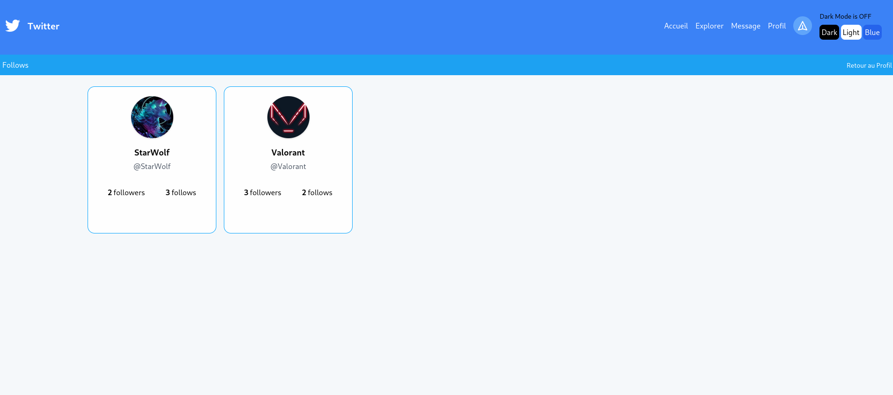

# Twitter 

## Introduction

👋 Bienvenue !

Le but de ce projet était de refaire les fonctionnalités de Twitter et de les réaliser en 1 mois par groupe de 4.

Il s'agit de notre premier gros projet de la formation.

## Fonctionnalités

- Système d'authentification
- Page Profil
- Édit le profil 
- Système de tweet et d'afficher les tweet
- System de follow et followers (pouvant être afficher)

## Captures d'écran

